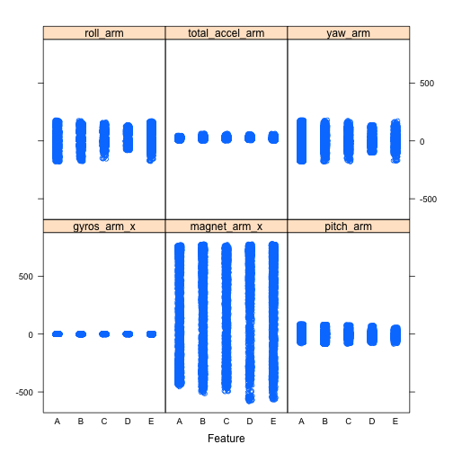
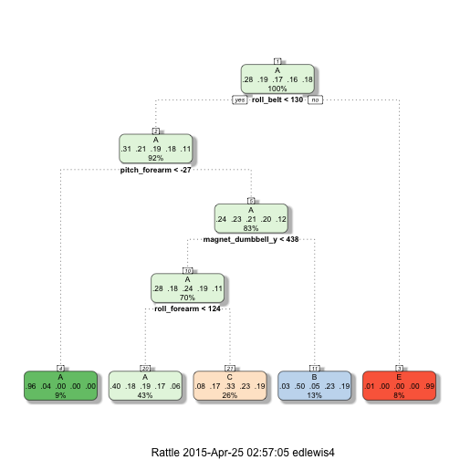

## Executive Summary
The goal of this predictive model is to use data from personal activity devices' accelerometers on the belt, forearm, arm, and dumbell of 6 participants to determine the classe of the barbell lift they performed.  The participants performed barbell lifts correctly and incorrectly in 5 different ways (A, B, C, D, E).   The overall predictive model chosen has an accuracy rate of 99.3% and an out of sample error to be 0.7%

## Exploratory Data Analysis
Load libraries needed for this effort and initial datasets to data.frames

The data for this project come from this source: ```http://groupware.les.inf.puc-rio.br/har```


```r
## Practical Machine Learning
suppressMessages(library(ggplot2))
suppressMessages(library(caret))
suppressMessages(library(rattle))
suppressMessages(library(randomForest))
suppressMessages(library(knitr))
suppressMessages(library(gbm))
suppressMessages(library(rpart))

## The training data for this project are available here: 
TRAINFILE <- "https://d396qusza40orc.cloudfront.net/predmachlearn/pml-training.csv"

## The test data are available here:         
TESTFILE <- "https://d396qusza40orc.cloudfront.net/predmachlearn/pml-testing.csv"

if(!file.exists("./pml-training.csv")) { download.file(TRAINFILE, destfile="./pml-training.csv", method="curl") }
if(!file.exists("./pml-testing.csv")) { download.file(TESTFILE, destfile="./pml-testing.csv", method="curl") }

## Read in data to dataframes
pml_training <- read.csv("./pml-training.csv")
pml_testing <- read.csv("./pml-testing.csv")
```

Split the training dataset into a training and testing dataset so we can use the training subset to build a predictive model and do some validation on the new testing subset
  

```r
## create training and testing subset from pml_training data
set.seed(33234)
inTrain = createDataPartition(y=pml_training$classe,p=0.7, list=FALSE)
training <- pml_training[inTrain,]
testing <- pml_training[-inTrain,]
```
  
Now lets look at some of the overall data in the new training dataset.

```r
## look at sample data and structure of data
head(training)
```

```
##   X user_name raw_timestamp_part_1 raw_timestamp_part_2   cvtd_timestamp
## 1 1  carlitos           1323084231               788290 05/12/2011 11:23
## 3 3  carlitos           1323084231               820366 05/12/2011 11:23
## 4 4  carlitos           1323084232               120339 05/12/2011 11:23
## 5 5  carlitos           1323084232               196328 05/12/2011 11:23
## 6 6  carlitos           1323084232               304277 05/12/2011 11:23
## 7 7  carlitos           1323084232               368296 05/12/2011 11:23
##   new_window num_window roll_belt pitch_belt yaw_belt total_accel_belt
## 1         no         11      1.41       8.07    -94.4                3
## 3         no         11      1.42       8.07    -94.4                3
## 4         no         12      1.48       8.05    -94.4                3
## 5         no         12      1.48       8.07    -94.4                3
## 6         no         12      1.45       8.06    -94.4                3
## 7         no         12      1.42       8.09    -94.4                3
##   kurtosis_roll_belt kurtosis_picth_belt kurtosis_yaw_belt
## 1                                                         
## 3                                                         
## 4                                                         
## 5                                                         
## 6                                                         
## 7                                                         
##   skewness_roll_belt skewness_roll_belt.1 skewness_yaw_belt max_roll_belt
## 1                                                                      NA
## 3                                                                      NA
## 4                                                                      NA
## 5                                                                      NA
## 6                                                                      NA
## 7                                                                      NA
##   max_picth_belt max_yaw_belt min_roll_belt min_pitch_belt min_yaw_belt
## 1             NA                         NA             NA             
## 3             NA                         NA             NA             
## 4             NA                         NA             NA             
## 5             NA                         NA             NA             
## 6             NA                         NA             NA             
## 7             NA                         NA             NA             
##   amplitude_roll_belt amplitude_pitch_belt amplitude_yaw_belt
## 1                  NA                   NA                   
## 3                  NA                   NA                   
## 4                  NA                   NA                   
## 5                  NA                   NA                   
## 6                  NA                   NA                   
## 7                  NA                   NA                   
##   var_total_accel_belt avg_roll_belt stddev_roll_belt var_roll_belt
## 1                   NA            NA               NA            NA
## 3                   NA            NA               NA            NA
## 4                   NA            NA               NA            NA
## 5                   NA            NA               NA            NA
## 6                   NA            NA               NA            NA
## 7                   NA            NA               NA            NA
##   avg_pitch_belt stddev_pitch_belt var_pitch_belt avg_yaw_belt
## 1             NA                NA             NA           NA
## 3             NA                NA             NA           NA
## 4             NA                NA             NA           NA
## 5             NA                NA             NA           NA
## 6             NA                NA             NA           NA
## 7             NA                NA             NA           NA
##   stddev_yaw_belt var_yaw_belt gyros_belt_x gyros_belt_y gyros_belt_z
## 1              NA           NA         0.00         0.00        -0.02
## 3              NA           NA         0.00         0.00        -0.02
## 4              NA           NA         0.02         0.00        -0.03
## 5              NA           NA         0.02         0.02        -0.02
## 6              NA           NA         0.02         0.00        -0.02
## 7              NA           NA         0.02         0.00        -0.02
##   accel_belt_x accel_belt_y accel_belt_z magnet_belt_x magnet_belt_y
## 1          -21            4           22            -3           599
## 3          -20            5           23            -2           600
## 4          -22            3           21            -6           604
## 5          -21            2           24            -6           600
## 6          -21            4           21             0           603
## 7          -22            3           21            -4           599
##   magnet_belt_z roll_arm pitch_arm yaw_arm total_accel_arm var_accel_arm
## 1          -313     -128      22.5    -161              34            NA
## 3          -305     -128      22.5    -161              34            NA
## 4          -310     -128      22.1    -161              34            NA
## 5          -302     -128      22.1    -161              34            NA
## 6          -312     -128      22.0    -161              34            NA
## 7          -311     -128      21.9    -161              34            NA
##   avg_roll_arm stddev_roll_arm var_roll_arm avg_pitch_arm stddev_pitch_arm
## 1           NA              NA           NA            NA               NA
## 3           NA              NA           NA            NA               NA
## 4           NA              NA           NA            NA               NA
## 5           NA              NA           NA            NA               NA
## 6           NA              NA           NA            NA               NA
## 7           NA              NA           NA            NA               NA
##   var_pitch_arm avg_yaw_arm stddev_yaw_arm var_yaw_arm gyros_arm_x
## 1            NA          NA             NA          NA        0.00
## 3            NA          NA             NA          NA        0.02
## 4            NA          NA             NA          NA        0.02
## 5            NA          NA             NA          NA        0.00
## 6            NA          NA             NA          NA        0.02
## 7            NA          NA             NA          NA        0.00
##   gyros_arm_y gyros_arm_z accel_arm_x accel_arm_y accel_arm_z magnet_arm_x
## 1        0.00       -0.02        -288         109        -123         -368
## 3       -0.02       -0.02        -289         110        -126         -368
## 4       -0.03        0.02        -289         111        -123         -372
## 5       -0.03        0.00        -289         111        -123         -374
## 6       -0.03        0.00        -289         111        -122         -369
## 7       -0.03        0.00        -289         111        -125         -373
##   magnet_arm_y magnet_arm_z kurtosis_roll_arm kurtosis_picth_arm
## 1          337          516                                     
## 3          344          513                                     
## 4          344          512                                     
## 5          337          506                                     
## 6          342          513                                     
## 7          336          509                                     
##   kurtosis_yaw_arm skewness_roll_arm skewness_pitch_arm skewness_yaw_arm
## 1                                                                       
## 3                                                                       
## 4                                                                       
## 5                                                                       
## 6                                                                       
## 7                                                                       
##   max_roll_arm max_picth_arm max_yaw_arm min_roll_arm min_pitch_arm
## 1           NA            NA          NA           NA            NA
## 3           NA            NA          NA           NA            NA
## 4           NA            NA          NA           NA            NA
## 5           NA            NA          NA           NA            NA
## 6           NA            NA          NA           NA            NA
## 7           NA            NA          NA           NA            NA
##   min_yaw_arm amplitude_roll_arm amplitude_pitch_arm amplitude_yaw_arm
## 1          NA                 NA                  NA                NA
## 3          NA                 NA                  NA                NA
## 4          NA                 NA                  NA                NA
## 5          NA                 NA                  NA                NA
## 6          NA                 NA                  NA                NA
## 7          NA                 NA                  NA                NA
##   roll_dumbbell pitch_dumbbell yaw_dumbbell kurtosis_roll_dumbbell
## 1      13.05217      -70.49400    -84.87394                       
## 3      12.85075      -70.27812    -85.14078                       
## 4      13.43120      -70.39379    -84.87363                       
## 5      13.37872      -70.42856    -84.85306                       
## 6      13.38246      -70.81759    -84.46500                       
## 7      13.12695      -70.24757    -85.09961                       
##   kurtosis_picth_dumbbell kurtosis_yaw_dumbbell skewness_roll_dumbbell
## 1                                                                     
## 3                                                                     
## 4                                                                     
## 5                                                                     
## 6                                                                     
## 7                                                                     
##   skewness_pitch_dumbbell skewness_yaw_dumbbell max_roll_dumbbell
## 1                                                              NA
## 3                                                              NA
## 4                                                              NA
## 5                                                              NA
## 6                                                              NA
## 7                                                              NA
##   max_picth_dumbbell max_yaw_dumbbell min_roll_dumbbell min_pitch_dumbbell
## 1                 NA                                 NA                 NA
## 3                 NA                                 NA                 NA
## 4                 NA                                 NA                 NA
## 5                 NA                                 NA                 NA
## 6                 NA                                 NA                 NA
## 7                 NA                                 NA                 NA
##   min_yaw_dumbbell amplitude_roll_dumbbell amplitude_pitch_dumbbell
## 1                                       NA                       NA
## 3                                       NA                       NA
## 4                                       NA                       NA
## 5                                       NA                       NA
## 6                                       NA                       NA
## 7                                       NA                       NA
##   amplitude_yaw_dumbbell total_accel_dumbbell var_accel_dumbbell
## 1                                          37                 NA
## 3                                          37                 NA
## 4                                          37                 NA
## 5                                          37                 NA
## 6                                          37                 NA
## 7                                          37                 NA
##   avg_roll_dumbbell stddev_roll_dumbbell var_roll_dumbbell
## 1                NA                   NA                NA
## 3                NA                   NA                NA
## 4                NA                   NA                NA
## 5                NA                   NA                NA
## 6                NA                   NA                NA
## 7                NA                   NA                NA
##   avg_pitch_dumbbell stddev_pitch_dumbbell var_pitch_dumbbell
## 1                 NA                    NA                 NA
## 3                 NA                    NA                 NA
## 4                 NA                    NA                 NA
## 5                 NA                    NA                 NA
## 6                 NA                    NA                 NA
## 7                 NA                    NA                 NA
##   avg_yaw_dumbbell stddev_yaw_dumbbell var_yaw_dumbbell gyros_dumbbell_x
## 1               NA                  NA               NA                0
## 3               NA                  NA               NA                0
## 4               NA                  NA               NA                0
## 5               NA                  NA               NA                0
## 6               NA                  NA               NA                0
## 7               NA                  NA               NA                0
##   gyros_dumbbell_y gyros_dumbbell_z accel_dumbbell_x accel_dumbbell_y
## 1            -0.02             0.00             -234               47
## 3            -0.02             0.00             -232               46
## 4            -0.02            -0.02             -232               48
## 5            -0.02             0.00             -233               48
## 6            -0.02             0.00             -234               48
## 7            -0.02             0.00             -232               47
##   accel_dumbbell_z magnet_dumbbell_x magnet_dumbbell_y magnet_dumbbell_z
## 1             -271              -559               293               -65
## 3             -270              -561               298               -63
## 4             -269              -552               303               -60
## 5             -270              -554               292               -68
## 6             -269              -558               294               -66
## 7             -270              -551               295               -70
##   roll_forearm pitch_forearm yaw_forearm kurtosis_roll_forearm
## 1         28.4         -63.9        -153                      
## 3         28.3         -63.9        -152                      
## 4         28.1         -63.9        -152                      
## 5         28.0         -63.9        -152                      
## 6         27.9         -63.9        -152                      
## 7         27.9         -63.9        -152                      
##   kurtosis_picth_forearm kurtosis_yaw_forearm skewness_roll_forearm
## 1                                                                  
## 3                                                                  
## 4                                                                  
## 5                                                                  
## 6                                                                  
## 7                                                                  
##   skewness_pitch_forearm skewness_yaw_forearm max_roll_forearm
## 1                                                           NA
## 3                                                           NA
## 4                                                           NA
## 5                                                           NA
## 6                                                           NA
## 7                                                           NA
##   max_picth_forearm max_yaw_forearm min_roll_forearm min_pitch_forearm
## 1                NA                               NA                NA
## 3                NA                               NA                NA
## 4                NA                               NA                NA
## 5                NA                               NA                NA
## 6                NA                               NA                NA
## 7                NA                               NA                NA
##   min_yaw_forearm amplitude_roll_forearm amplitude_pitch_forearm
## 1                                     NA                      NA
## 3                                     NA                      NA
## 4                                     NA                      NA
## 5                                     NA                      NA
## 6                                     NA                      NA
## 7                                     NA                      NA
##   amplitude_yaw_forearm total_accel_forearm var_accel_forearm
## 1                                        36                NA
## 3                                        36                NA
## 4                                        36                NA
## 5                                        36                NA
## 6                                        36                NA
## 7                                        36                NA
##   avg_roll_forearm stddev_roll_forearm var_roll_forearm avg_pitch_forearm
## 1               NA                  NA               NA                NA
## 3               NA                  NA               NA                NA
## 4               NA                  NA               NA                NA
## 5               NA                  NA               NA                NA
## 6               NA                  NA               NA                NA
## 7               NA                  NA               NA                NA
##   stddev_pitch_forearm var_pitch_forearm avg_yaw_forearm
## 1                   NA                NA              NA
## 3                   NA                NA              NA
## 4                   NA                NA              NA
## 5                   NA                NA              NA
## 6                   NA                NA              NA
## 7                   NA                NA              NA
##   stddev_yaw_forearm var_yaw_forearm gyros_forearm_x gyros_forearm_y
## 1                 NA              NA            0.03            0.00
## 3                 NA              NA            0.03           -0.02
## 4                 NA              NA            0.02           -0.02
## 5                 NA              NA            0.02            0.00
## 6                 NA              NA            0.02           -0.02
## 7                 NA              NA            0.02            0.00
##   gyros_forearm_z accel_forearm_x accel_forearm_y accel_forearm_z
## 1           -0.02             192             203            -215
## 3            0.00             196             204            -213
## 4            0.00             189             206            -214
## 5           -0.02             189             206            -214
## 6           -0.03             193             203            -215
## 7           -0.02             195             205            -215
##   magnet_forearm_x magnet_forearm_y magnet_forearm_z classe
## 1              -17              654              476      A
## 3              -18              658              469      A
## 4              -16              658              469      A
## 5              -17              655              473      A
## 6               -9              660              478      A
## 7              -18              659              470      A
```

```r
str(training)
```

```
## 'data.frame':	13737 obs. of  160 variables:
##  $ X                       : int  1 3 4 5 6 7 8 10 11 12 ...
##  $ user_name               : Factor w/ 6 levels "adelmo","carlitos",..: 2 2 2 2 2 2 2 2 2 2 ...
##  $ raw_timestamp_part_1    : int  1323084231 1323084231 1323084232 1323084232 1323084232 1323084232 1323084232 1323084232 1323084232 1323084232 ...
##  $ raw_timestamp_part_2    : int  788290 820366 120339 196328 304277 368296 440390 484434 500302 528316 ...
##  $ cvtd_timestamp          : Factor w/ 20 levels "02/12/2011 13:32",..: 9 9 9 9 9 9 9 9 9 9 ...
##  $ new_window              : Factor w/ 2 levels "no","yes": 1 1 1 1 1 1 1 1 1 1 ...
##  $ num_window              : int  11 11 12 12 12 12 12 12 12 12 ...
##  $ roll_belt               : num  1.41 1.42 1.48 1.48 1.45 1.42 1.42 1.45 1.45 1.43 ...
##  $ pitch_belt              : num  8.07 8.07 8.05 8.07 8.06 8.09 8.13 8.17 8.18 8.18 ...
##  $ yaw_belt                : num  -94.4 -94.4 -94.4 -94.4 -94.4 -94.4 -94.4 -94.4 -94.4 -94.4 ...
##  $ total_accel_belt        : int  3 3 3 3 3 3 3 3 3 3 ...
##  $ kurtosis_roll_belt      : Factor w/ 397 levels "","-0.016850",..: 1 1 1 1 1 1 1 1 1 1 ...
##  $ kurtosis_picth_belt     : Factor w/ 317 levels "","-0.021887",..: 1 1 1 1 1 1 1 1 1 1 ...
##  $ kurtosis_yaw_belt       : Factor w/ 2 levels "","#DIV/0!": 1 1 1 1 1 1 1 1 1 1 ...
##  $ skewness_roll_belt      : Factor w/ 395 levels "","-0.003095",..: 1 1 1 1 1 1 1 1 1 1 ...
##  $ skewness_roll_belt.1    : Factor w/ 338 levels "","-0.005928",..: 1 1 1 1 1 1 1 1 1 1 ...
##  $ skewness_yaw_belt       : Factor w/ 2 levels "","#DIV/0!": 1 1 1 1 1 1 1 1 1 1 ...
##  $ max_roll_belt           : num  NA NA NA NA NA NA NA NA NA NA ...
##  $ max_picth_belt          : int  NA NA NA NA NA NA NA NA NA NA ...
##  $ max_yaw_belt            : Factor w/ 68 levels "","-0.1","-0.2",..: 1 1 1 1 1 1 1 1 1 1 ...
##  $ min_roll_belt           : num  NA NA NA NA NA NA NA NA NA NA ...
##  $ min_pitch_belt          : int  NA NA NA NA NA NA NA NA NA NA ...
##  $ min_yaw_belt            : Factor w/ 68 levels "","-0.1","-0.2",..: 1 1 1 1 1 1 1 1 1 1 ...
##  $ amplitude_roll_belt     : num  NA NA NA NA NA NA NA NA NA NA ...
##  $ amplitude_pitch_belt    : int  NA NA NA NA NA NA NA NA NA NA ...
##  $ amplitude_yaw_belt      : Factor w/ 4 levels "","#DIV/0!","0.00",..: 1 1 1 1 1 1 1 1 1 1 ...
##  $ var_total_accel_belt    : num  NA NA NA NA NA NA NA NA NA NA ...
##  $ avg_roll_belt           : num  NA NA NA NA NA NA NA NA NA NA ...
##  $ stddev_roll_belt        : num  NA NA NA NA NA NA NA NA NA NA ...
##  $ var_roll_belt           : num  NA NA NA NA NA NA NA NA NA NA ...
##  $ avg_pitch_belt          : num  NA NA NA NA NA NA NA NA NA NA ...
##  $ stddev_pitch_belt       : num  NA NA NA NA NA NA NA NA NA NA ...
##  $ var_pitch_belt          : num  NA NA NA NA NA NA NA NA NA NA ...
##  $ avg_yaw_belt            : num  NA NA NA NA NA NA NA NA NA NA ...
##  $ stddev_yaw_belt         : num  NA NA NA NA NA NA NA NA NA NA ...
##  $ var_yaw_belt            : num  NA NA NA NA NA NA NA NA NA NA ...
##  $ gyros_belt_x            : num  0 0 0.02 0.02 0.02 0.02 0.02 0.03 0.03 0.02 ...
##  $ gyros_belt_y            : num  0 0 0 0.02 0 0 0 0 0 0 ...
##  $ gyros_belt_z            : num  -0.02 -0.02 -0.03 -0.02 -0.02 -0.02 -0.02 0 -0.02 -0.02 ...
##  $ accel_belt_x            : int  -21 -20 -22 -21 -21 -22 -22 -21 -21 -22 ...
##  $ accel_belt_y            : int  4 5 3 2 4 3 4 4 2 2 ...
##  $ accel_belt_z            : int  22 23 21 24 21 21 21 22 23 23 ...
##  $ magnet_belt_x           : int  -3 -2 -6 -6 0 -4 -2 -3 -5 -2 ...
##  $ magnet_belt_y           : int  599 600 604 600 603 599 603 609 596 602 ...
##  $ magnet_belt_z           : int  -313 -305 -310 -302 -312 -311 -313 -308 -317 -319 ...
##  $ roll_arm                : num  -128 -128 -128 -128 -128 -128 -128 -128 -128 -128 ...
##  $ pitch_arm               : num  22.5 22.5 22.1 22.1 22 21.9 21.8 21.6 21.5 21.5 ...
##  $ yaw_arm                 : num  -161 -161 -161 -161 -161 -161 -161 -161 -161 -161 ...
##  $ total_accel_arm         : int  34 34 34 34 34 34 34 34 34 34 ...
##  $ var_accel_arm           : num  NA NA NA NA NA NA NA NA NA NA ...
##  $ avg_roll_arm            : num  NA NA NA NA NA NA NA NA NA NA ...
##  $ stddev_roll_arm         : num  NA NA NA NA NA NA NA NA NA NA ...
##  $ var_roll_arm            : num  NA NA NA NA NA NA NA NA NA NA ...
##  $ avg_pitch_arm           : num  NA NA NA NA NA NA NA NA NA NA ...
##  $ stddev_pitch_arm        : num  NA NA NA NA NA NA NA NA NA NA ...
##  $ var_pitch_arm           : num  NA NA NA NA NA NA NA NA NA NA ...
##  $ avg_yaw_arm             : num  NA NA NA NA NA NA NA NA NA NA ...
##  $ stddev_yaw_arm          : num  NA NA NA NA NA NA NA NA NA NA ...
##  $ var_yaw_arm             : num  NA NA NA NA NA NA NA NA NA NA ...
##  $ gyros_arm_x             : num  0 0.02 0.02 0 0.02 0 0.02 0.02 0.02 0.02 ...
##  $ gyros_arm_y             : num  0 -0.02 -0.03 -0.03 -0.03 -0.03 -0.02 -0.03 -0.03 -0.03 ...
##  $ gyros_arm_z             : num  -0.02 -0.02 0.02 0 0 0 0 -0.02 0 0 ...
##  $ accel_arm_x             : int  -288 -289 -289 -289 -289 -289 -289 -288 -290 -288 ...
##  $ accel_arm_y             : int  109 110 111 111 111 111 111 110 110 111 ...
##  $ accel_arm_z             : int  -123 -126 -123 -123 -122 -125 -124 -124 -123 -123 ...
##  $ magnet_arm_x            : int  -368 -368 -372 -374 -369 -373 -372 -376 -366 -363 ...
##  $ magnet_arm_y            : int  337 344 344 337 342 336 338 334 339 343 ...
##  $ magnet_arm_z            : int  516 513 512 506 513 509 510 516 509 520 ...
##  $ kurtosis_roll_arm       : Factor w/ 330 levels "","-0.02438",..: 1 1 1 1 1 1 1 1 1 1 ...
##  $ kurtosis_picth_arm      : Factor w/ 328 levels "","-0.00484",..: 1 1 1 1 1 1 1 1 1 1 ...
##  $ kurtosis_yaw_arm        : Factor w/ 395 levels "","-0.01548",..: 1 1 1 1 1 1 1 1 1 1 ...
##  $ skewness_roll_arm       : Factor w/ 331 levels "","-0.00051",..: 1 1 1 1 1 1 1 1 1 1 ...
##  $ skewness_pitch_arm      : Factor w/ 328 levels "","-0.00184",..: 1 1 1 1 1 1 1 1 1 1 ...
##  $ skewness_yaw_arm        : Factor w/ 395 levels "","-0.00311",..: 1 1 1 1 1 1 1 1 1 1 ...
##  $ max_roll_arm            : num  NA NA NA NA NA NA NA NA NA NA ...
##  $ max_picth_arm           : num  NA NA NA NA NA NA NA NA NA NA ...
##  $ max_yaw_arm             : int  NA NA NA NA NA NA NA NA NA NA ...
##  $ min_roll_arm            : num  NA NA NA NA NA NA NA NA NA NA ...
##  $ min_pitch_arm           : num  NA NA NA NA NA NA NA NA NA NA ...
##  $ min_yaw_arm             : int  NA NA NA NA NA NA NA NA NA NA ...
##  $ amplitude_roll_arm      : num  NA NA NA NA NA NA NA NA NA NA ...
##  $ amplitude_pitch_arm     : num  NA NA NA NA NA NA NA NA NA NA ...
##  $ amplitude_yaw_arm       : int  NA NA NA NA NA NA NA NA NA NA ...
##  $ roll_dumbbell           : num  13.1 12.9 13.4 13.4 13.4 ...
##  $ pitch_dumbbell          : num  -70.5 -70.3 -70.4 -70.4 -70.8 ...
##  $ yaw_dumbbell            : num  -84.9 -85.1 -84.9 -84.9 -84.5 ...
##  $ kurtosis_roll_dumbbell  : Factor w/ 398 levels "","-0.0035","-0.0073",..: 1 1 1 1 1 1 1 1 1 1 ...
##  $ kurtosis_picth_dumbbell : Factor w/ 401 levels "","-0.0163","-0.0233",..: 1 1 1 1 1 1 1 1 1 1 ...
##  $ kurtosis_yaw_dumbbell   : Factor w/ 2 levels "","#DIV/0!": 1 1 1 1 1 1 1 1 1 1 ...
##  $ skewness_roll_dumbbell  : Factor w/ 401 levels "","-0.0082","-0.0096",..: 1 1 1 1 1 1 1 1 1 1 ...
##  $ skewness_pitch_dumbbell : Factor w/ 402 levels "","-0.0053","-0.0084",..: 1 1 1 1 1 1 1 1 1 1 ...
##  $ skewness_yaw_dumbbell   : Factor w/ 2 levels "","#DIV/0!": 1 1 1 1 1 1 1 1 1 1 ...
##  $ max_roll_dumbbell       : num  NA NA NA NA NA NA NA NA NA NA ...
##  $ max_picth_dumbbell      : num  NA NA NA NA NA NA NA NA NA NA ...
##  $ max_yaw_dumbbell        : Factor w/ 73 levels "","-0.1","-0.2",..: 1 1 1 1 1 1 1 1 1 1 ...
##  $ min_roll_dumbbell       : num  NA NA NA NA NA NA NA NA NA NA ...
##  $ min_pitch_dumbbell      : num  NA NA NA NA NA NA NA NA NA NA ...
##  $ min_yaw_dumbbell        : Factor w/ 73 levels "","-0.1","-0.2",..: 1 1 1 1 1 1 1 1 1 1 ...
##  $ amplitude_roll_dumbbell : num  NA NA NA NA NA NA NA NA NA NA ...
##   [list output truncated]
```

```r
colnames(training)
```

```
##   [1] "X"                        "user_name"               
##   [3] "raw_timestamp_part_1"     "raw_timestamp_part_2"    
##   [5] "cvtd_timestamp"           "new_window"              
##   [7] "num_window"               "roll_belt"               
##   [9] "pitch_belt"               "yaw_belt"                
##  [11] "total_accel_belt"         "kurtosis_roll_belt"      
##  [13] "kurtosis_picth_belt"      "kurtosis_yaw_belt"       
##  [15] "skewness_roll_belt"       "skewness_roll_belt.1"    
##  [17] "skewness_yaw_belt"        "max_roll_belt"           
##  [19] "max_picth_belt"           "max_yaw_belt"            
##  [21] "min_roll_belt"            "min_pitch_belt"          
##  [23] "min_yaw_belt"             "amplitude_roll_belt"     
##  [25] "amplitude_pitch_belt"     "amplitude_yaw_belt"      
##  [27] "var_total_accel_belt"     "avg_roll_belt"           
##  [29] "stddev_roll_belt"         "var_roll_belt"           
##  [31] "avg_pitch_belt"           "stddev_pitch_belt"       
##  [33] "var_pitch_belt"           "avg_yaw_belt"            
##  [35] "stddev_yaw_belt"          "var_yaw_belt"            
##  [37] "gyros_belt_x"             "gyros_belt_y"            
##  [39] "gyros_belt_z"             "accel_belt_x"            
##  [41] "accel_belt_y"             "accel_belt_z"            
##  [43] "magnet_belt_x"            "magnet_belt_y"           
##  [45] "magnet_belt_z"            "roll_arm"                
##  [47] "pitch_arm"                "yaw_arm"                 
##  [49] "total_accel_arm"          "var_accel_arm"           
##  [51] "avg_roll_arm"             "stddev_roll_arm"         
##  [53] "var_roll_arm"             "avg_pitch_arm"           
##  [55] "stddev_pitch_arm"         "var_pitch_arm"           
##  [57] "avg_yaw_arm"              "stddev_yaw_arm"          
##  [59] "var_yaw_arm"              "gyros_arm_x"             
##  [61] "gyros_arm_y"              "gyros_arm_z"             
##  [63] "accel_arm_x"              "accel_arm_y"             
##  [65] "accel_arm_z"              "magnet_arm_x"            
##  [67] "magnet_arm_y"             "magnet_arm_z"            
##  [69] "kurtosis_roll_arm"        "kurtosis_picth_arm"      
##  [71] "kurtosis_yaw_arm"         "skewness_roll_arm"       
##  [73] "skewness_pitch_arm"       "skewness_yaw_arm"        
##  [75] "max_roll_arm"             "max_picth_arm"           
##  [77] "max_yaw_arm"              "min_roll_arm"            
##  [79] "min_pitch_arm"            "min_yaw_arm"             
##  [81] "amplitude_roll_arm"       "amplitude_pitch_arm"     
##  [83] "amplitude_yaw_arm"        "roll_dumbbell"           
##  [85] "pitch_dumbbell"           "yaw_dumbbell"            
##  [87] "kurtosis_roll_dumbbell"   "kurtosis_picth_dumbbell" 
##  [89] "kurtosis_yaw_dumbbell"    "skewness_roll_dumbbell"  
##  [91] "skewness_pitch_dumbbell"  "skewness_yaw_dumbbell"   
##  [93] "max_roll_dumbbell"        "max_picth_dumbbell"      
##  [95] "max_yaw_dumbbell"         "min_roll_dumbbell"       
##  [97] "min_pitch_dumbbell"       "min_yaw_dumbbell"        
##  [99] "amplitude_roll_dumbbell"  "amplitude_pitch_dumbbell"
## [101] "amplitude_yaw_dumbbell"   "total_accel_dumbbell"    
## [103] "var_accel_dumbbell"       "avg_roll_dumbbell"       
## [105] "stddev_roll_dumbbell"     "var_roll_dumbbell"       
## [107] "avg_pitch_dumbbell"       "stddev_pitch_dumbbell"   
## [109] "var_pitch_dumbbell"       "avg_yaw_dumbbell"        
## [111] "stddev_yaw_dumbbell"      "var_yaw_dumbbell"        
## [113] "gyros_dumbbell_x"         "gyros_dumbbell_y"        
## [115] "gyros_dumbbell_z"         "accel_dumbbell_x"        
## [117] "accel_dumbbell_y"         "accel_dumbbell_z"        
## [119] "magnet_dumbbell_x"        "magnet_dumbbell_y"       
## [121] "magnet_dumbbell_z"        "roll_forearm"            
## [123] "pitch_forearm"            "yaw_forearm"             
## [125] "kurtosis_roll_forearm"    "kurtosis_picth_forearm"  
## [127] "kurtosis_yaw_forearm"     "skewness_roll_forearm"   
## [129] "skewness_pitch_forearm"   "skewness_yaw_forearm"    
## [131] "max_roll_forearm"         "max_picth_forearm"       
## [133] "max_yaw_forearm"          "min_roll_forearm"        
## [135] "min_pitch_forearm"        "min_yaw_forearm"         
## [137] "amplitude_roll_forearm"   "amplitude_pitch_forearm" 
## [139] "amplitude_yaw_forearm"    "total_accel_forearm"     
## [141] "var_accel_forearm"        "avg_roll_forearm"        
## [143] "stddev_roll_forearm"      "var_roll_forearm"        
## [145] "avg_pitch_forearm"        "stddev_pitch_forearm"    
## [147] "var_pitch_forearm"        "avg_yaw_forearm"         
## [149] "stddev_yaw_forearm"       "var_yaw_forearm"         
## [151] "gyros_forearm_x"          "gyros_forearm_y"         
## [153] "gyros_forearm_z"          "accel_forearm_x"         
## [155] "accel_forearm_y"          "accel_forearm_z"         
## [157] "magnet_forearm_x"         "magnet_forearm_y"        
## [159] "magnet_forearm_z"         "classe"
```
  
   
From this we want to subset the training dataset to only those columns that have data related to the accelerometers    

```r
## Get accelerometers data only
## columns we want to keep begin with roll_, pitch_, yaw_ total_accel_, gyros, accel_
keep_cols <- c("^roll_","^pitch_","^yaw_","^total_accel_","^gyros_","^accel_","^magnet_")

df_index <- unique(grep(paste(keep_cols,collapse="|"),colnames(training)))

## add the classe column (160) to the index of accelerometers.  Just want to keep those columns
df_index <- c(df_index, 160)

training <- subset(training[df_index],)
```
  
  
We can visualize a few of the columns of data and the various "classe" types.

```r
featurePlot(x=training[,c("yaw_arm","pitch_arm","roll_arm","gyros_arm_x","magnet_arm_x","total_accel_arm")], y=training$classe,plot="strip", jitter=TRUE, colour=training$classe)
```

 

## Building Predictive Model
  
Lets initially try a tree based model

```r
set.seed(33234)
modFitA <- train(classe ~ . , method="rpart", data=training)
```

Here we can visualize the tree

```r
fancyRpartPlot(modFitA$finalModel)
```

 

And we can look at the overall details about the model.

```r
modFitA
```

```
## CART 
## 
## 13737 samples
##    52 predictor
##     5 classes: 'A', 'B', 'C', 'D', 'E' 
## 
## No pre-processing
## Resampling: Bootstrapped (25 reps) 
## 
## Summary of sample sizes: 13737, 13737, 13737, 13737, 13737, 13737, ... 
## 
## Resampling results across tuning parameters:
## 
##   cp          Accuracy   Kappa      Accuracy SD  Kappa SD  
##   0.03712745  0.5044759  0.3575277  0.03886135   0.06304805
##   0.05916658  0.3987921  0.1814864  0.05698406   0.09600325
##   0.11341674  0.3335799  0.0777421  0.04081946   0.05955912
## 
## Accuracy was used to select the optimal model using  the largest value.
## The final value used for the model was cp = 0.03712745.
```
From this we can see that the overall accuracy is relatively poor at 50.45%
  
If we look at the confusion matrix against the testing dataset we can see a significant number of activities were mis-classified.  The accuracy was just 50.33%


```r
predictions <- predict(modFitA, newdata=testing)
confusionMatrix(predictions, testing$classe)
```

```
## Confusion Matrix and Statistics
## 
##           Reference
## Prediction    A    B    C    D    E
##          A 1549  506  469  441  151
##          B   27  378   26  170  142
##          C   96  255  531  353  285
##          D    0    0    0    0    0
##          E    2    0    0    0  504
## 
## Overall Statistics
##                                                
##                Accuracy : 0.5033               
##                  95% CI : (0.4905, 0.5162)     
##     No Information Rate : 0.2845               
##     P-Value [Acc > NIR] : < 0.00000000000000022
##                                                
##                   Kappa : 0.35                 
##  Mcnemar's Test P-Value : NA                   
## 
## Statistics by Class:
## 
##                      Class: A Class: B Class: C Class: D Class: E
## Sensitivity            0.9253  0.33187  0.51754   0.0000  0.46580
## Specificity            0.6279  0.92309  0.79646   1.0000  0.99958
## Pos Pred Value         0.4971  0.50875  0.34934      NaN  0.99605
## Neg Pred Value         0.9549  0.85200  0.88660   0.8362  0.89255
## Prevalence             0.2845  0.19354  0.17434   0.1638  0.18386
## Detection Rate         0.2632  0.06423  0.09023   0.0000  0.08564
## Detection Prevalence   0.5295  0.12625  0.25828   0.0000  0.08598
## Balanced Accuracy      0.7766  0.62748  0.65700   0.5000  0.73269
```


So lets look for a better model.  Next try is generalized Boosting model

```r
set.seed(33234)
modFitB <- train(classe ~ . , data=training, method="gbm", verbose=FALSE)
modFitB
```

```
## Stochastic Gradient Boosting 
## 
## 13737 samples
##    52 predictor
##     5 classes: 'A', 'B', 'C', 'D', 'E' 
## 
## No pre-processing
## Resampling: Bootstrapped (25 reps) 
## 
## Summary of sample sizes: 13737, 13737, 13737, 13737, 13737, 13737, ... 
## 
## Resampling results across tuning parameters:
## 
##   interaction.depth  n.trees  Accuracy   Kappa      Accuracy SD
##   1                   50      0.7491898  0.6820576  0.007346866
##   1                  100      0.8175472  0.7691454  0.005712641
##   1                  150      0.8494707  0.8095753  0.004599870
##   2                   50      0.8504048  0.8105219  0.005820803
##   2                  100      0.9033969  0.8777892  0.003942821
##   2                  150      0.9276130  0.9084277  0.003413810
##   3                   50      0.8929037  0.8644582  0.005385826
##   3                  100      0.9369914  0.9202866  0.003490689
##   3                  150      0.9547724  0.9427864  0.003189291
##   Kappa SD   
##   0.009257287
##   0.007193789
##   0.005759521
##   0.007329281
##   0.004942060
##   0.004299395
##   0.006787248
##   0.004394089
##   0.004027860
## 
## Tuning parameter 'shrinkage' was held constant at a value of 0.1
## Accuracy was used to select the optimal model using  the largest value.
## The final values used for the model were n.trees = 150,
##  interaction.depth = 3 and shrinkage = 0.1.
```

Lets look at a confusion Matrix against the testing dataset.  Here we can see this is a much better model with a 95.99% accuracy rate.   Better, but lets see if we can still find a better prediction model.


```r
predictions <- predict(modFitB, newdata=testing)
confusionMatrix(predictions, testing$classe)
```

```
## Confusion Matrix and Statistics
## 
##           Reference
## Prediction    A    B    C    D    E
##          A 1653   48    0    2    1
##          B   17 1058   36    6   10
##          C    2   29  982   33   16
##          D    1    1    4  916   15
##          E    1    3    4    7 1040
## 
## Overall Statistics
##                                                
##                Accuracy : 0.9599               
##                  95% CI : (0.9546, 0.9648)     
##     No Information Rate : 0.2845               
##     P-Value [Acc > NIR] : < 0.00000000000000022
##                                                
##                   Kappa : 0.9492               
##  Mcnemar's Test P-Value : 0.000000008455       
## 
## Statistics by Class:
## 
##                      Class: A Class: B Class: C Class: D Class: E
## Sensitivity            0.9875   0.9289   0.9571   0.9502   0.9612
## Specificity            0.9879   0.9855   0.9835   0.9957   0.9969
## Pos Pred Value         0.9701   0.9388   0.9247   0.9776   0.9858
## Neg Pred Value         0.9950   0.9830   0.9909   0.9903   0.9913
## Prevalence             0.2845   0.1935   0.1743   0.1638   0.1839
## Detection Rate         0.2809   0.1798   0.1669   0.1556   0.1767
## Detection Prevalence   0.2895   0.1915   0.1805   0.1592   0.1793
## Balanced Accuracy      0.9877   0.9572   0.9703   0.9730   0.9790
```

  
  
Lets try a Random Forest model with cross-validation.  

```r
set.seed(33234)
fitControl <- trainControl(method="cv")
modFitC <- train(classe ~ . , data = training, method="rf" , trControl = fitControl)
modFitC
```

```
## Random Forest 
## 
## 13737 samples
##    52 predictor
##     5 classes: 'A', 'B', 'C', 'D', 'E' 
## 
## No pre-processing
## Resampling: Cross-Validated (10 fold) 
## 
## Summary of sample sizes: 12363, 12363, 12364, 12364, 12365, 12363, ... 
## 
## Resampling results across tuning parameters:
## 
##   mtry  Accuracy   Kappa      Accuracy SD  Kappa SD   
##    2    0.9917744  0.9895936  0.003533756  0.004471012
##   27    0.9927944  0.9908834  0.004078867  0.005161519
##   52    0.9866800  0.9831470  0.004510236  0.005708118
## 
## Accuracy was used to select the optimal model using  the largest value.
## The final value used for the model was mtry = 27.
```

Here we can see the overall accuracy is approx 99.3% .   The out of sample error is (1-accuracy = 0.7%) .  The accuracy is generally good and this is the model I will use for the real testing dataset.  

```r
predictions <- predict(modFitC, newdata=testing)
confusionMatrix(predictions, testing$classe)
```

```
## Confusion Matrix and Statistics
## 
##           Reference
## Prediction    A    B    C    D    E
##          A 1673    6    0    0    0
##          B    0 1131    4    0    1
##          C    1    2 1019   14    4
##          D    0    0    3  950    3
##          E    0    0    0    0 1074
## 
## Overall Statistics
##                                                
##                Accuracy : 0.9935               
##                  95% CI : (0.9911, 0.9954)     
##     No Information Rate : 0.2845               
##     P-Value [Acc > NIR] : < 0.00000000000000022
##                                                
##                   Kappa : 0.9918               
##  Mcnemar's Test P-Value : NA                   
## 
## Statistics by Class:
## 
##                      Class: A Class: B Class: C Class: D Class: E
## Sensitivity            0.9994   0.9930   0.9932   0.9855   0.9926
## Specificity            0.9986   0.9989   0.9957   0.9988   1.0000
## Pos Pred Value         0.9964   0.9956   0.9798   0.9937   1.0000
## Neg Pred Value         0.9998   0.9983   0.9986   0.9972   0.9983
## Prevalence             0.2845   0.1935   0.1743   0.1638   0.1839
## Detection Rate         0.2843   0.1922   0.1732   0.1614   0.1825
## Detection Prevalence   0.2853   0.1930   0.1767   0.1624   0.1825
## Balanced Accuracy      0.9990   0.9960   0.9944   0.9921   0.9963
```

We can look at which Variables were the most important in determining the answers

```r
varImp(modFitC)
```

```
## rf variable importance
## 
##   only 20 most important variables shown (out of 52)
## 
##                      Overall
## roll_belt             100.00
## pitch_forearm          60.33
## yaw_belt               53.83
## pitch_belt             44.43
## magnet_dumbbell_z      42.86
## magnet_dumbbell_y      42.56
## roll_forearm           40.23
## accel_dumbbell_y       20.79
## roll_dumbbell          18.75
## magnet_dumbbell_x      17.93
## accel_forearm_x        17.42
## magnet_belt_z          15.55
## total_accel_dumbbell   14.89
## accel_dumbbell_z       14.79
## magnet_forearm_z       13.92
## accel_belt_z           13.35
## gyros_belt_z           12.01
## magnet_belt_y          11.60
## yaw_arm                11.25
## magnet_belt_x          10.41
```

## FINAL CONCLUSION
The Random Forest model (modFitC) is the chosen model to use for prediciton.  It had a 99.3% accuracy rate.   This will be used against the testing dataset for submission.


